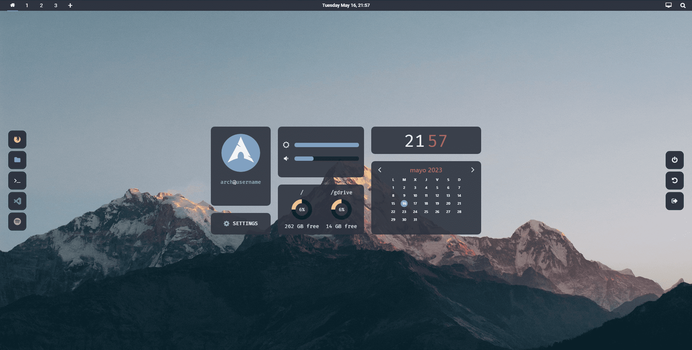

# Web Linux

Web page that looks like a linux desktop.

The idea was inspired by this [portfolio](https://vivek9patel.github.io/) and the design comes from [here](https://github.com/drahenprofi/dotfiles)

### [Go to website](https://weblinux.netlify.app) &#x279c;

## Tecnologies Used

- Vue
- Sass
- JavaScript
- Babel

## Commands List

```sh
npm run dev # to development
npm run build # to production
npm start # run serve
```

## Preview


